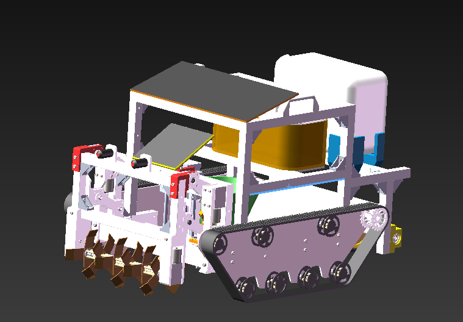
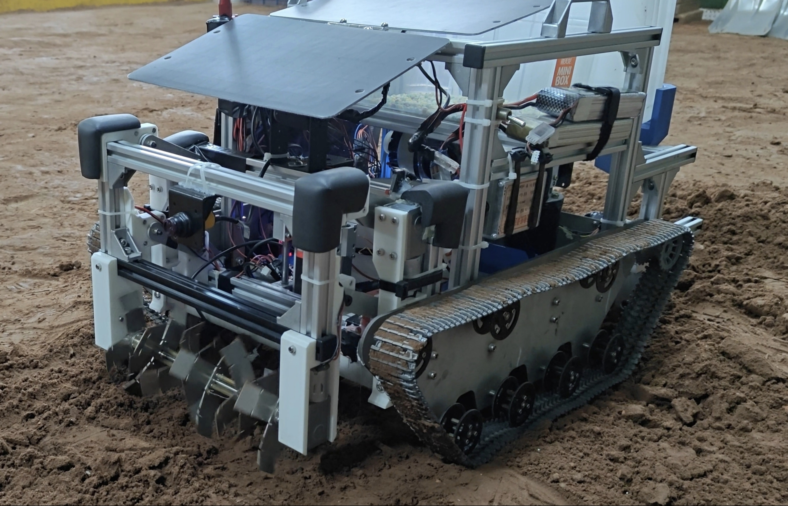

# 🌱 多功能豆类播种机

<div align="center">

**基于 STM32F103 的智能履带式播种机 —— 集"行走 · 旋耕 · 开沟 · 播种 · 覆土 · 浇水"于一体**

[](https://www.st.com/)
[](https://www.keil.com/)
[](https://www.st.com/)
[](https://www.solidworks.com/)
[](https://www.segger.com/)

</div>

---

## 📖 目录

- [项目简介](#-项目简介)
- [演示视频](#-演示视频)
- [项目展示](#-项目展示)
- [功能特性](#-功能特性)
- [整机结构](#️-整机结构)
- [硬件资源与引脚分配](#-硬件资源与引脚分配)
- [蓝牙遥控指令](#-蓝牙遥控指令)
- [软件设计](#-软件设计)
- [目录结构](#-目录结构)
- [快速上手](#-快速上手)
- [开发说明与已知问题](#-开发说明与已知问题)

---

## 📝 项目简介

传统人工播种效率低、株距不均。本项目设计了一款面向豆类作物的**小型多功能自动播种机**，由履带底盘搭载旋耕、开沟、精量排种、浇水等多套执行机构，以 STM32F103 为主控制器，通过蓝牙串口由手机 App 遥控作业，并具备限位开关与光电接近开关双重安全保护。

**主要指标**

| 项目 | 参数 |
| :--- | :--- |
| 主控制器 | STM32F103ZET6（正点原子精英板） |
| 主频 | 72 MHz |
| 行走方式 | 履带式双直流减速电机驱动 |
| 驱动方式 | 直流电机 PWM（10 kHz）+ A4988 步进驱动 |
| 通信方式 | 蓝牙串口 USART2 @ 9600 bps |
| 人机交互 | TFT LCD 实时状态显示 |
| 步进精度 | A4988 细分布进，每脉冲 0.1° |

---

## 🎬 演示视频

### 📺 [点击观看演示视频（B 站 BV14Pas6bEMW）](https://www.bilibili.com/video/BV14Pas6bEMW/?share_source=copy_web&vd_source=6c446a2c349afac65ccd988e4ed9c128)

[](https://www.bilibili.com/video/BV14Pas6bEMW/?share_source=copy_web&vd_source=6c446a2c349afac65ccd988e4ed9c128)

---

## 🖼️ 项目展示

<table>
  <tr>
    <th align="center">三维模型（SolidWorks）</th>
    <th align="center">实物样机</th>
  </tr>
  <tr>
    <td align="center"></td>
    <td align="center"></td>
  </tr>
  <tr>
    <td align="center">整机装配体 <code>模型1/装配体.SLDASM</code></td>
    <td align="center">已加工装配完成并通过实地作业测试</td>
  </tr>
</table>

---

## ✨ 功能特性

- 🚜 **履带行走**：双路直流减速电机 + PWM 调速，支持前进 / 后退 / 左转 / 右转（差速转向）
- ⛏️ **旋耕碎土**：独立旋耕刀辊电机，同时可通过丝杆机构整体升降，适应不同耕作深度
- 🪓 **开沟起垄**：步进电机驱动的丝杆升降开沟器，落沟深度精确可控
- 🌰 **精量排种**：42 步进电机 + 组合播种器，由定时器节拍间歇转动实现定量播种
- 💧 **播种后浇水**：水泵 + 喷头 + 水箱机构，随播种同步开启
- 🔄 **覆土回填**：覆土板刮土回填沟槽，一次成型
- 📶 **蓝牙遥控**：手机 App 经 USART2 下发单字节指令，实时切换作业模式
- 🛡️ **多重限位保护**：3 路机械限位开关（PE0~PE2）+ 3 路光电接近开关（PD11~PD13），越程即停
- 🖥️ **状态可视化**：LCD 实时刷新各限位状态、接近开关状态与当前指令码

---

## 🏗️ 整机结构

SolidWorks 源文件位于 `模型1/`，按功能模块组织：

| 装配体文件 | 说明 |
| :--- | :--- |
| `装配体.SLDASM` | 整机总装 |
| `装配底盘.SLDASM` | 履带底盘、承重轮、主动轮、压紧轮 |
| `组合翻土轮.SLDASM` / `装配翻土轮.SLDASM` | 旋耕刀辊与升降保持架（丝杆 8X100 + 直线轴承） |
| `组合开沟器.SLDASM` / `装配开槽器.SLDASM` | 开沟头与升降架板 |
| `组合播种器.SLDASM` / `演示功能播种器.SLDASM` | 储种箱、存种盘、筛种盘、播种管道 |
| `组合浇水机构.SLDASM` | 水箱、水泵、喷头、吸/出水管 |
| `筛种盘/` | 含 4 张工程图（`.DWG`）与对应零件 |
| `装配体.STEP` | 通用 STEP 格式，**无需 SolidWorks 亦可查看** |
| `演示文稿1.pptx` | 项目汇报演示文稿 |

> 零件文件（`.SLDPRT`）共计 100 余个，涵盖机加工件、标准件与钣金件，均按功能命名，可直接用于出图加工。

---

## 🔌 硬件资源与引脚分配

### 主控板

**正点原子 STM32F103ZET6 精英板**（Flash 512 KB，SRAM 64 KB，工程宏：`STM32F10X_HD, USE_STDPERIPH_DRIVER`，启动文件 `startup_stm32f10x_hd.s`）

### 引脚分配总表

| 功能模块 | 方向 IO | PWM / 脉冲 | 说明 |
| :--- | :--- | :--- | :--- |
| **蓝牙串口** | PA2 (TX) / PA3 (RX) | — | USART2，9600 bps，接收中断 |
| **限位开关** | PE0 / PE1 / PE2 | — | 上拉输入，旋耕升降 / 开沟器行程终点检测 |
| **光电接近开关** | PD11 / PD12 / PD13 | — | 上拉输入，前后行进障碍物检测 |
| **履带左轮** | PB14 / PB15（INA） | PA0 — TIM2_CH1 | 直流减速电机正反转 + 调速 |
| **履带右轮** | PB13 / PB12（INB） | PA1 — TIM2_CH2 | 直流减速电机正反转 + 调速 |
| **旋耕器升降电机** | PA4 / PA5 | PA6 — TIM3_CH1 | 丝杆升降机构 |
| **旋耕刀辊电机** | PC4 / PC5 | PA7 — TIM3_CH2 | 旋耕碎土主电机 |
| **开沟器升降步进** | PC8 (STEP) / PC9 (DIR) | — | A4988 驱动器 |
| **播种步进电机** | PF14 (STEP) / PF15 (DIR) | — | A4988 驱动器 |
| **浇水水泵电机** | PF4 / PF5 | PA10 — TIM1_CH3 | 水泵启停 |
| **备用步进通道** | PF12/PF13、PC10/PC11 | — | 预留扩展 |
| **调试串口** | PA9 (TX) / PA10 (RX) | — | USART1 @ 9600，打印调试（⚠️ RX 脚 PA10 与水泵 PWM 复用，见文末「开发说明与已知问题」） |

> 完整 IO 说明亦见原始备份文件：`keil代码/README.TXT`

### 定时器资源分配

| 定时器 | 用途 | 配置 |
| :--- | :--- | :--- |
| TIM1 | 浇水水泵 PWM 输出 | 周期 8000-1，预分频 9-1 → 1 kHz |
| TIM2 | 左右履带电机 PWM | 同上 |
| TIM3 | 旋耕升降 / 旋耕刀辊 PWM | 同上 |
| TIM5 | 播种节拍定时中断 | 预分频 7200-1，周期 10000-1 → **1 s** 触发一次排种 |
| SysTick | `delay_ms()` / `delay_us()` 软件延时基准 | — |

---

## 📲 蓝牙遥控指令

主控串口 2 中断接收单字节数据存入 `temp1`，主循环据此切换作业状态：

| 指令值 | 动作 | 保护条件 |
| :---: | :--- | :--- |
| `0` | 使能播种定时器时钟 | — |
| `1` | 履带前进（双轮正转） | 前方光电开关检测到障碍（`gd1 == 0`）即停 |
| `2` | 履带后退（双轮反转） | 后方光电开关检测到障碍（`gd2 == 0`）即停 |
| `3` | **急停**：履带、旋耕、水泵、定时器全部停止 | — |
| `4` | 旋耕刀辊启动 | — |
| `5` | 旋耕器下降 | 触下限位（`num0 == 0`）自动停 |
| `6` | 旋耕器上升 | 触上限位（`num1 == 0`）自动停 |
| `7` | 浇水水泵启动 | — |
| `8` | 开沟器下降 | — |
| `9` | 开沟器上升 | 触上限位（`num2 == 0`）自动停 |
| `16` | 启动播种定时器（TIM5），进入定量排种节拍 | — |
| `17` | 左转（左轮反转 / 右轮正转） | — |
| `18` | 右转（左轮正转 / 右轮反转） | — |

**典型作业流程**

```
1 → 前进到作业区          → 3 停车
5 → 旋耕器下降至耕作深度  → 4 开启旋耕
8 → 开沟器下降至开沟深度  → 16 启动排种节拍
1 → 边前进边播种          → 7 同步浇水
9 / 6 → 作业结束收起机构  → 3 全部停止
```

---

## 💻 软件设计

### 主程序流程

```
main()
 ├─ delay_init()            延时基准初始化
 ├─ uart_init(9600)         USART1 调试串口
 ├─ LCD_Init()              TFT 屏初始化
 ├─ USART2_Init()           蓝牙串口 + 接收中断
 ├─ AIN_GPIO_Config / GENERAL_TIM_Init           ← TIM2 履带
 ├─ AIN_GPIO_Config2 / GENERAL_TIM_Init2         ← TIM3 旋耕
 ├─ AIN_GPIO_Config3 / GENERAL_TIM_Init3         ← TIM1 水泵
 ├─ MOTOR_Init()            A4988 步进 IO
 ├─ Xianwei_init()          限位开关 IO
 └─ while(1)
     ├─ 读取三路限位 + 两路光电 → LCD 实时显示
     └─ switch(temp1) 执行对应动作（含限位急停判断）
```

### 源码文件说明

| 文件 | 作用 |
| :--- | :--- |
| `USER/main.c` | 主循环状态机、传感器读取、LCD 显示、动作执行与安全互锁 |
| `USER/openmv.c/.h` | USART2 初始化与接收中断，蓝牙指令解码（**注：文件名为历史遗留，本项目实际接蓝牙模块**） |
| `USER/Motor_PWM.c/.h` | TIM2 履带双电机 PWM 驱动与正反转控制 |
| `USER/motor2.c/.h` | TIM3 旋耕升降 + 旋耕刀辊 PWM 驱动 |
| `USER/motor3.c/.h` | TIM1 水泵 PWM 驱动 |
| `USER/Stepper_A4988.c/.h` | A4988 步进脉冲生成，`Stepgo(电机号, 方向, 脉冲数)` |
| `USER/Stepper_motor.c` / `Stepper_motor2.c` | 备选的相序式步进驱动方案（当前未在主控流程中使用） |
| `USER/tim.c/.h` | TIM5 播种节拍中断，每次中断调用 `Stepgo(2, 0, 1500)` 排种 |
| `USER/xianwei.c/.h` | PE0~PE2 机械限位开关读取 |
| `USER/gd.c/.h` | PD11~PD13 光电接近开关读取 |
| `SYSTEM/delay`、`sys`、`usart` | 正点原子系统级延时、位带操作、调试串口 |
| `HARDWARE/LCD`、`LED`、`KEY` | TFT 显示、指示灯、按键外设驱动 |

### 步进电机驱动

`Stepgo(num, dir, step)` 通过 DIR 电平设定转向，再输出指定数量的 STEP 脉冲，脉冲宽度由 `delay_us()` 控制：

| 电机编号 | STEP / DIR | 用途 | 脉冲宽度 |
| :---: | :--- | :--- | :--- |
| 1 | PF12 / PF13 | 预留 | 200 µs |
| 2 | PF14 / PF15 | **播种排种** | 1000 µs |
| 3 | PC8 / PC9 | **开沟器升降** | 500 µs |
| 4 | PC10 / PC11 | 预留 | 1 ms |

### LCD 显示内容

LCD 上实时刷新 6 个状态量，方便现场排查传感器接线与机构到位情况：

```
限位0 / 限位1 / 限位2        ← PE0 / PE1 / PE2
当前指令 temp1               ← 蓝牙最新下发
光电1 / 光电2                ← PD11 / PD12
```

---

## 📁 目录结构

```
多功能豆类播种机/
├── 📄 README.md                 # 本说明文档
├── 📄 .gitignore                # 忽略编译产物与软件临时文件
│
├── 🖼️ 图片/                      # README 用图（模型渲染图、实物图）
├── 📷 样机照片/                  # 实物照片原图
│
├── 🎬 播种机演示视频.mp4         # 演示视频源文件（约 68 MB，建议不提交 Git）
│                                 #   在线观看：https://www.bilibili.com/video/BV14Pas6bEMW
│
├── 🧊 模型1/                     # SolidWorks 三维模型
│   ├── 装配体.SLDASM            # 整机总装
│   ├── 装配体.STEP              # 通用 STEP，无 SW 也可打开
│   ├── *.SLDPRT                 # 100+ 零件文件
│   ├── 筛种盘/                  # 含 DWG 工程图
│   └── 演示文稿1.pptx           # 项目汇报 PPT
│
└── 💾 keil代码/                  # STM32 Keil MDK 工程
    ├── USER/                    # 应用代码与工程文件（LCD.uvprojx）
    ├── HARDWARE/                # 外设驱动：LED / KEY / LCD
    ├── SYSTEM/                  # 系统底层：delay / sys / usart
    ├── STM32F10x_FWLib/         # ST 标准外设库
    ├── CORE/                    # 内核与启动文件
    ├── OBJ/                     # 编译输出（已 gitignore）
    └── README.TXT               # 原始 IO 与外设分配说明
```

---

## 🚀 快速上手

### 1. 编译与下载

1. 安装 **Keil MDK5**（需安装 STM32F1xx Device Family Pack）
2. 打开 `keil代码/USER/LCD.uvprojx`
3. Target Options → Device 选择 **STM32F103ZE**，C/C++ Define 保持 `STM32F10X_HD, USE_STDPERIPH_DRIVER`
4. 通过 **J-Link / ST-Link** SWD 接口连接板子，点击 Load 下载程序

### 2. 蓝牙连接

1. 蓝牙模块 TXD / RXD 交叉接至 **PA3(RX) / PA2(TX)**，波特率 **9600**（8N1，无流控）
2. 手机上打开蓝牙串口助手 App，配对模块
3. 以**十六进制 / 数值模式**发送上述指令码（如发送 `16` 启动排种流程图所示流程）

> ⚠️ 请勿以 ASCII 字符模式发送，代码按接收到的字节数值直接判别。

### 3. 查看三维模型

- 安装 SolidWorks：打开 `模型1/装配体.SLDASM`
- 无 SolidWorks：任意三维/CAD 软件打开 `模型1/装配体.STEP`

---

## ⚠️ 开发说明与已知问题

- **`openmv.c` 命名误导**：该文件实际实现的是 USART2 蓝牙接收，OpenMV 视觉模块并未接入，建议后续重命名为 `bluetooth.c`。
- **冗余文件**：`Stepper_motor.c` / `Stepper_motor2.c` 为早期 ULN2003 相序驱动方案，已被 A4988 方案替代，暂未从工程移除。
- **主循环阻塞**：`Stepgo()` 内部使用阻塞式 `delay_us()`，输出脉冲数较多时会长时间占用主循环，导致蓝牙指令响应延迟（如 `Stepgo(2,0,1500)` 约需 3 s）。建议改为定时器比较输出或 DMA 方式产生脉冲。
- **PA10 引脚冲突**：`uart_init()` 将 USART1_RX 配置在 PA10，而浇水水泵 PWM（TIM1_CH3）同样使用 PA10，两者存在复用冲突，实际测试中需二选一或重映射。
- **`GD_Value()` 返回值未全覆盖**：`i` 取其他值时函数无返回值，属潜在隐患。
- **中文注释编码**：源码为 GBK 编码上传，建议保持原编码以避免乱码。

**后续改进方向**

- [ ] 引入编码器 + PID 实现履带速度闭环与直线行驶纠偏
- [ ] 增加 OpenMV 视觉模块实现自动循垄导航
- [ ] 步进脉冲改为定时器 DMA/比较输出，释放 CPU
- [ ] 增加 Wi-Fi 模块接入物联网平台，实现远程作业调度
- [ ] 补充电源管理与电量检测

---

## 🧰 开发环境

| 类别 | 工具 / 型号 |
| :--- | :--- |
| MCU | STM32F103ZET6（正点原子精英板） |
| IDE | Keil MDK5（ARMCC 5） |
| 固件库 | STM32F10x Standard Peripheral Library |
| 下载器 | J-Link / ST-Link（SWD） |
| 串口调试 | 蓝牙串口助手 App、SSCOM |
| 三维设计 | SolidWorks |

---

## 📄 许可

<div align="center">

本项目为课程设计 / 毕业设计作品，仅供学习与交流使用。

⭐ 如果这个项目对你有帮助，欢迎点个 Star！

</div>
